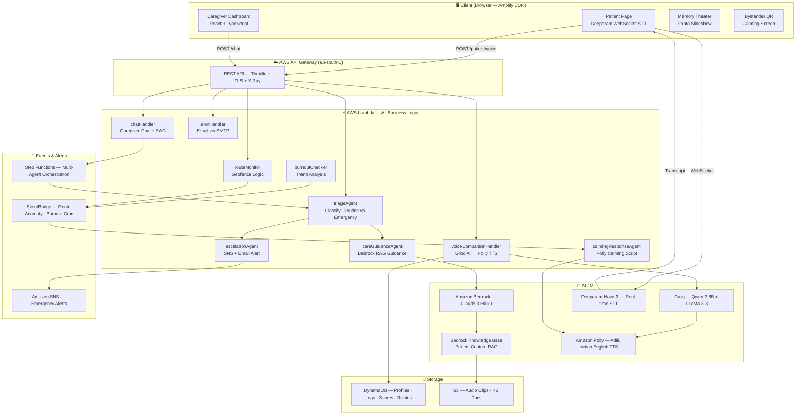
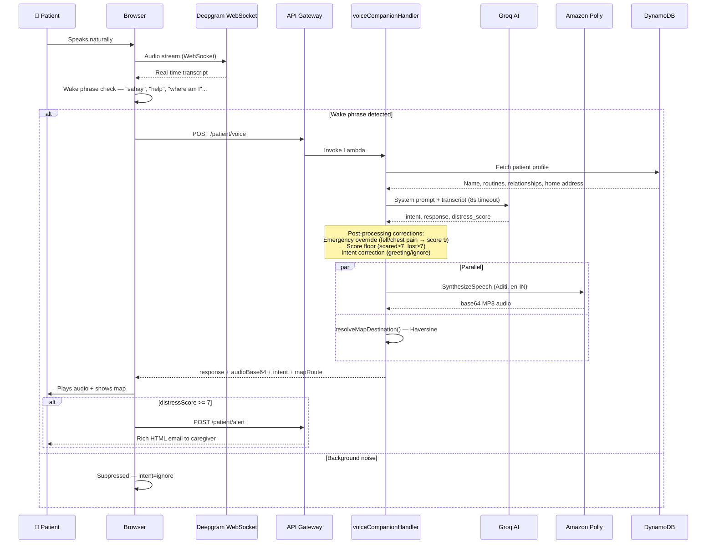
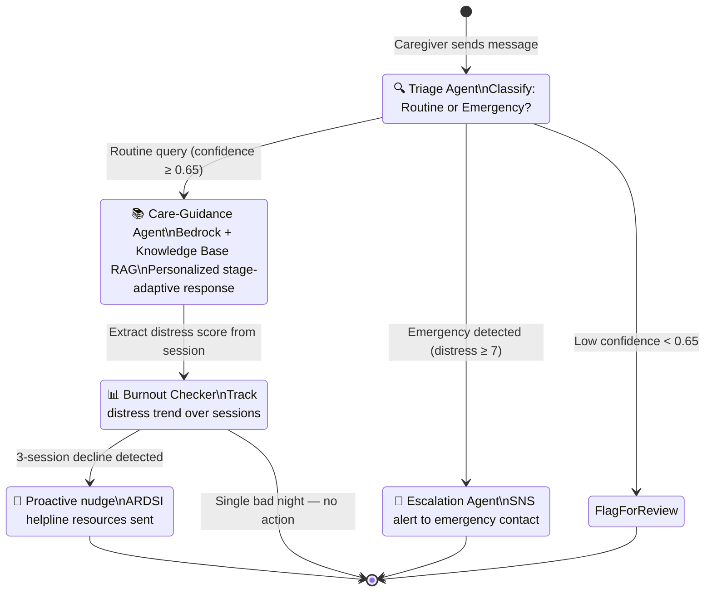
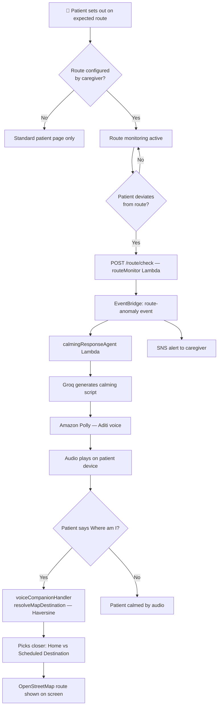
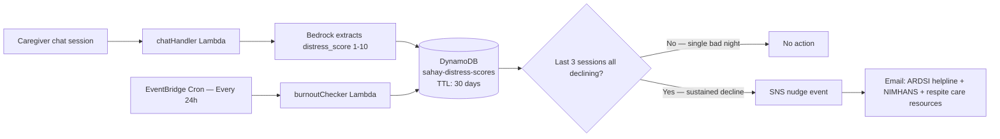
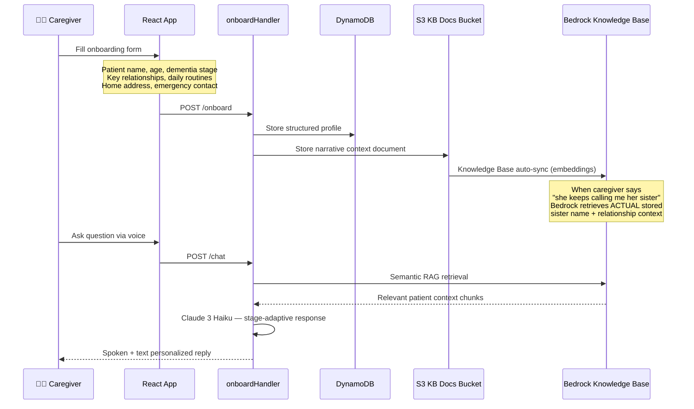
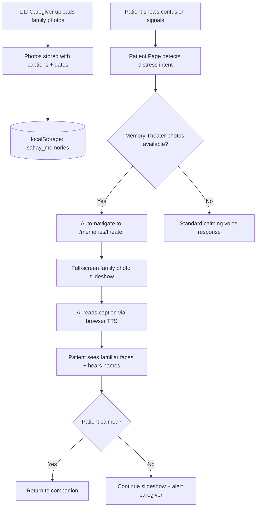

# Sahay · सहाय 💙

> **Voice-First Alzheimer''s Caregiver & Safety Companion**
> Built for the **First Commit Hackathon 2026** · Bharat Builds Tour (WeMakeDevs × AWS) · Ship It Track
> 🌐 **[main.sahay.amplifyapp.com](https://main.sahay.amplifyapp.com)** · 🔌 API: `https://m4fcfzmsa7.execute-api.ap-south-1.amazonaws.com/prod/`

---

## The Problem

India has **8.8 million people living with dementia**, projected to cross **17 million by 2050**. Family caregivers — typically a spouse or adult child — figure it out entirely alone. Existing tools like SAGE-LEAF explicitly require English literacy and reliable internet to even enroll, completely excluding most Indian caregivers whose documented barriers are:

- ❌ Lack of time
- ❌ Limited internet access
- ❌ Digital illiteracy

**Sahay requires zero tech skills.** It is entirely voice-driven, speaks the local language, and works in moments of crisis when caregivers have no time to navigate apps or read articles.

---

## What Sahay Does

| User | Feature | How it works |
|---|---|---|
| 🧑‍⚕️ **Caregiver** | Voice-first AI guidance | Speak in Hindi/English, get personalized advice grounded in your patient''s context |
| 🧑‍⚕️ **Caregiver** | Emergency escalation | AI detects crisis, fires SNS alert + rich email instantly |
| 🧑‍⚕️ **Caregiver** | Burnout tracking | Distress scores trend-analyzed over sessions, proactive nudge before collapse |
| 🧠 **Patient** | Voice companion | Speaks to Sahay, gets calming responses, is never confused alone |
| 🧠 **Patient** | Route safety | Gets guided home if lost; caregiver alerted with location |
| 🧠 **Patient** | Memory Theater | AI-narrated family photo slideshow to stay grounded |
| 🌍 **Bystander** | QR card | Scans patient''s card, sees calming screen + emergency contact |

---

## Architecture Overview



---

## Patient Voice AI Pipeline



---

## Multi-Agent Orchestration (Step Functions)



---

## Route Anomaly & Calming Flow



---

## Burnout Tracker



---

## Onboarding & RAG Pipeline



---

## Memory Theater



---

## AWS Services

| Service | Role | Why |
|---|---|---|
| **Bedrock (Claude 3 Haiku)** | Triage, care guidance, distress scoring | State-of-art reasoning, fast, cheap per-token |
| **Bedrock Knowledge Base** | RAG — patient personal context embeddings | Managed embeddings + retrieval, no vector DB to run |
| **Step Functions** | Multi-agent orchestration | Visual state machine, retry logic, parallel branches |
| **Lambda** (Node.js 24.x) | All backend logic — 16 functions | Scales 0→1000 concurrent, pay-per-ms |
| **API Gateway** | Client-facing REST API | Managed TLS, throttle, X-Ray tracing |
| **DynamoDB** | Profiles, logs, distress scores, route configs | Single-digit ms reads, PAY_PER_REQUEST, TTL |
| **S3** | KB docs, audio clips (24h auto-delete) | Durable, lifecycle rules for privacy |
| **Amazon Polly** (Aditi) | Indian English TTS | Warm natural Indian English, <300ms |
| **Deepgram Nova-2** | Always-on real-time STT WebSocket | 500ms transcript latency |
| **Amazon SNS** | Emergency caregiver alerts | Fan-out for future multi-caregiver |
| **EventBridge** | Route anomaly + burnout cron | Decoupled event bus |
| **Cognito** | Caregiver authentication | Managed user pools |
| **Amplify Hosting** | Frontend + global CDN | Git-push deploy, HTTPS, SPA rewrites |
| **AWS CDK** (TypeScript) | Infrastructure as code | Full stack in one `cdk deploy` |
| **Groq** (Qwen 3.8B) | Patient voice AI — ultra-low latency | Sub-2s responses for real-time use |

---

## Tech Stack

```
Frontend:      React 19 + TypeScript · Vite 8 · TailwindCSS 3 · React Router 7
Backend:       Node.js 24.x ESM · AWS Lambda × 16 · AWS CDK TypeScript
AI:            Groq (Qwen 3.8B / LLaMA 3.3) · Amazon Bedrock (Claude 3 Haiku)
               Bedrock Knowledge Base · Amazon Polly · Deepgram Nova-2
Storage:       DynamoDB (4 tables) · S3 (2 buckets)
Events:        Amazon SNS · EventBridge · Step Functions
Auth:          Amazon Cognito
Hosting:       AWS Amplify (CDN) + API Gateway
```

---

## Performance

| Operation | P50 | P95 | P99 | Hard Cap |
|---|---|---|---|---|
| Page startup (mic ready) | ~300ms | ~500ms | ~800ms | — |
| Deepgram STT transcript | ~500ms | ~800ms | ~1.2s | — |
| Groq AI response | ~1.5s | ~3s | ~5s | **8s** |
| Polly TTS synthesis | ~200ms | ~350ms | ~600ms | — |
| **Speak → hear reply (E2E)** | **~2.5s** | **~4s** | **~7s** | **8s** |
| Caregiver alert email | ~400ms | ~1s | ~2s | — |

**Concurrent capacity:** Lambda 1000 → ~5,000 simultaneous active patients.

---

## Design Principles

- **Fallback-first** — every AI call has a hardcoded offline fallback; never crashes silently
- **Confidence-gated** — triage < 0.65 confidence flags for human review, never auto-escalates
- **Idempotent alerts** — DynamoDB conditional write dedup prevents duplicate emergency emails
- **Least-privilege IAM** — each Lambda has its own scoped role
- **Privacy-by-design** — S3 audio has 24h lifecycle auto-expiry; no continuous cloud audio
- **Empathy in engineering** — warm amber theme for patients, premium dark for caregivers

---

## API Endpoints

| Method | Path | Description |
|---|---|---|
| GET | `/health` | Liveness check |
| POST | `/onboard` | Create/update caregiver + patient profile |
| POST | `/chat` | Caregiver AI chat (Step Functions) |
| POST | `/patient/voice` | Patient voice AI → Polly audio |
| POST | `/patient/alert` | Caregiver emergency email |
| POST | `/patient/transcribe` | Groq Whisper PTT transcription |
| GET | `/deepgram/token` | Secure Deepgram key proxy |
| POST | `/route/set` | Set expected patient route |
| POST | `/route/check` | Check for route deviation |
| POST | `/qr/generate` | Generate bystander QR code |

---

## Quick Start

```bash
# 1. Deploy infrastructure
cd infrastructure && npm install
cdk bootstrap aws://YOUR_ACCOUNT_ID/ap-south-1
cdk deploy

# 2. Run frontend locally
cd frontend && cp .env.example .env.local
# Edit .env.local with ApiUrl from CDK output
npm install && npm run dev
```

---

## Impact

- **8.8 million families** directly impacted today → 17 million by 2050
- **Caregiver burnout** detected proactively — not after collapse
- **Patient dignity** preserved — safety net without stripping independence
- **Zero tech skills required** — entirely voice-driven, no menus, no reading

---

> **Not a medical device. Does not diagnose Alzheimer's or any medical condition.**
> For real emergencies: **112** (India) | **100** (Police) | **ARDSI: 1800-200-ARDSI**

*Built with ❤️ for India''s 8.8 million dementia patients and their families*
