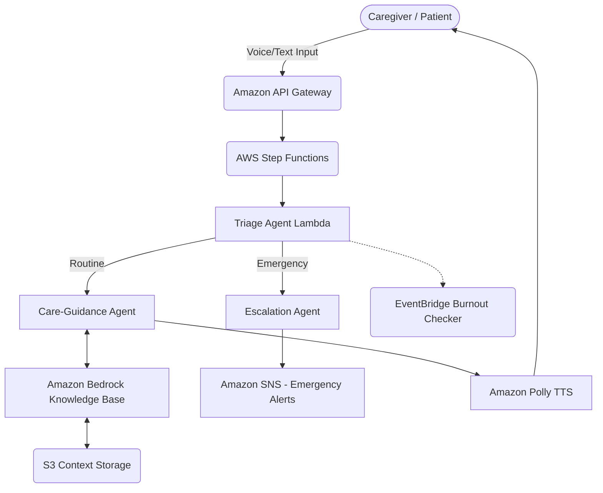

# Sahay · सहाय 💙 - AWS Hackathon Presentation

## 🏗️ Architecture & Tech Stack

**Frontend:** React (TypeScript), Vite, TailwindCSS, AWS Amplify Hosting.
**Backend / Infrastructure:** Node.js Lambdas (ESM), AWS CDK (TypeScript).
**AI Models:** Claude 3 Haiku (via Amazon Bedrock), Amazon Polly (TTS).

### 🔄 System Dataflow

## ☁️ How AWS Was Used

We utilized AWS as the backbone of Sahay's event-driven, multi-agent architecture:
- **Amazon Bedrock (Claude 3 Haiku)**: The core intelligence for triage classification, generating RAG-grounded guidance, and patient-calming scripts.
- **Bedrock Knowledge Base & S3**: Storing patient-specific contexts (routines, relationships) for deeply personalized responses instead of generic tips.
- **AWS Step Functions**: Orchestrating the complex, multi-agent flow—seamlessly routing queries to either routine care guidance or emergency escalation paths.
- **Amazon EventBridge & SNS**: Triggering route anomaly alerts and monitoring caregiver distress over time to proactively send support nudges.
- **AWS CDK**: Entire infrastructure as code, ensuring repeatable, one-click deployments.
- **Amazon Polly**: Converting dynamic AI responses back into natural, vernacular voice.

## 🌱 Learnings & Growth

Building Sahay during this hackathon fundamentally shifted our perspective on AI in healthcare. 
- **Empathy in Engineering**: We learned that tech must adapt to the user, not the other way around. Realizing that complex UI fails caregivers in crisis drove our pivot to a voice-first approach.
- **Agentic Orchestration**: Implementing AWS Step Functions taught us how to decouple monolithic AI prompts into specialized, highly reliable agents (Triage vs. Guidance).
- **Scalable Impact**: Leveraging AWS CDK and Bedrock allowed us to move from an idea to a highly robust, scalable system in days, demonstrating how quickly cloud infrastructure can be leveraged for social good.

---

## 🎙️ 50-Second Speech Script

*(Word count: ~125 words, approx 50 seconds spoken at a normal pace)*

"India has almost nine million people living with dementia, and their family caregivers are figuring it out entirely alone. That's why we built **Sahay**. 

Sahay is a voice-first, AI companion built entirely on AWS. Caregivers simply speak in their native language during a crisis, and our system uses **Amazon Bedrock** and **Knowledge Bases** to provide deeply personalized, patient-specific guidance—not generic WebMD articles.

Behind the scenes, we use **AWS Step Functions** to orchestrate specialized agents. A Triage Agent instantly determines if a situation is routine, or if it needs to trigger an **Amazon SNS** emergency escalation. 

Through this hackathon, we learned the true power of **Empathy in Engineering**. By combining AWS's serverless ecosystem with advanced AI, we aren’t just building an app; we are building a 24/7 lifeline for those who need it most."
